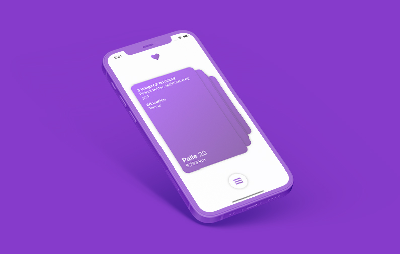

  
  <h1>Meetr</h1>
  
  

    A dating app focused on personality instead of looks
  

 

<!-- Table of Contents -->
# :notebook_with_decorative_cover: Table of Contents

- [About the Project](#star2-about-the-project)
  * [Tech Stack](#space_invader-tech-stack)
- [License](#warning-license)
- [Contact](#handshake-contact)
- [Acknowledgements](#gem-acknowledgements)
  

<!-- About the Project -->
## :star2: About the Project
Meetr is an app where you first can see the person you have been chatting with after you have been writing with the person long enough. Moreover you only get a certain amount of matches per day so people don't just swipe endlessly because there is also a more interestin person next swipe but engage in the person the matches with and gets to know them. The profiles descriptions are only allowed to be short confined descriptions about yourself so it is less about the first impression but 

<!-- Screenshots -->
### :camera: Screenshots

 
  
  
  
  
  

<!-- TechStack -->
### :space_invader: Tech Stack
* Swift
* SwiftUI
* Firebase

<!-- License -->
## :warning: License

Distributed under the MIT License.
